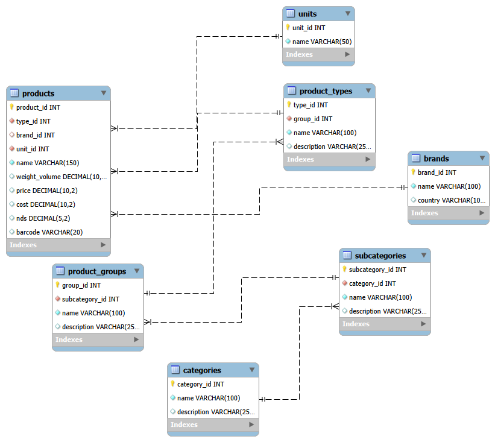

# Pyaterochka Database

Учебный проект: база данных для сети магазинов «Пятёрочка» с парсерами и генератором данных.

## Что это

Проект демонстрирует навыки проектирования баз данных, работы с MySQL, написания парсеров на Python (Selenium, requests) и генерации тестовых данных.

## Структура базы

- **categories** — категории (Бакалея, Молочная продукция и т.д.)
- **subcategories** — подкатегории (Макароны, крупы; Сыры и т.д.)
- **product_groups** — группы товаров (Макаронные изделия, Молоко)
- **product_types** — виды товаров (Спагетти, Рис, Сыр)
- **brands** — бренды (Makfa, Barilla, Простоквашино)
- **units** — единицы измерения (г, кг, л, шт)
- **products** — товары с ценой, весом, себестоимостью, НДС и штрихкодом

## ER-диаграмма

## Файлы

- `schema.sql` — создание таблиц
- `inserts.sql` — тестовые данные
- `queries.sql` — примеры запросов (JOIN, GROUP BY, агрегация)
- `docs/er_diagram.png` — ER-диаграмма
- `parser/parser.py` — загрузка данных из `parsed_data.txt` в MySQL
- `parser/selenium_parser.py` — парсер 5ka.ru через Selenium
- `parser/api_parser.py` — парсер 5ka.ru через API
- `parser/generate_data.py` — генератор тестовых данных
- `parser/parsed_data.txt` — данные для загрузки

## Как использовать

1. Выполни `schema.sql` в MySQL Workbench.
2. Запусти `inserts.sql` для тестовых данных.
3. Используй `queries.sql` для примеров запросов.
4. Для генерации данных: `python parser/generate_data.py`
5. Для загрузки в MySQL: `python parser/parser.py`

## Технологии

- MySQL + SQL Workbench
- Python 3.11
- Selenium + undetected-chromedriver
- requests
- Git

## Примечание

Парсеры Selenium и API оставлены для демонстрации навыков работы с динамическими сайтами и API. Сайт 5ka.ru имеет антибот-защиту, поэтому для наполнения базы используется генератор данных. Это не отменяет работоспособность парсеров — они корректно обрабатывают HTML и JSON, но требуют свежих куки и обхода блокировок.